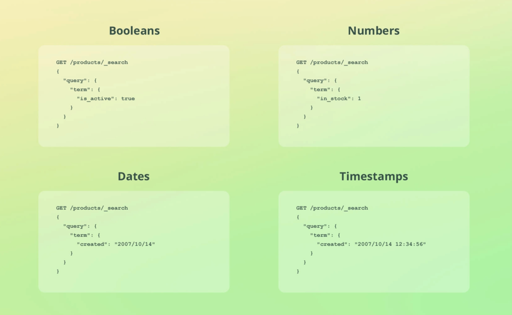
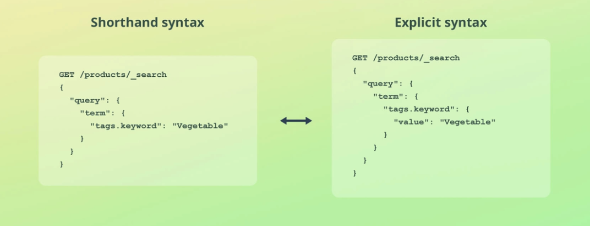

term used for keyword keyword, integer, boolean, date but text not work correctly(see inside term query.md file)

---

## text and keyword

- mapping of index:-

```json
"mappings": {
    "properties": {
        "name": {
            "type": "text",
            "fields": {
                "keyword": {
                    "type": "keyword",
                    "ignore_above": 256
                }
            }
        },
        "price": {
            "type": "long"
        },
        "stock": {
            "type": "long"
        }
    }
}
```

- now add doc

```json
{
  "name": "Smartphone",
  "price": 500,
  "stock": 100
}
```

- run term query

it's not give any data

```json
{
  "query": {
    "term": {
      "name": "Smartphone"
    }
  }
}
```

because searching thing term is store as lowercase and not see inside keyword storage

- to see keyword storage

```json
{
  "query": {
    "term": {
      "name.keyword": "Smartphone"
    }
  }
}
```

---

## only keyword

- mapping of index:-

```json
{
  "mappings": {
    "properties": {
      "name": {
        "type": "keyword"
      },
      "price": {
        "type": "integer"
      },
      "stock": {
        "type": "integer"
      }
    }
  }
}
```

- now add doc

```json
{
  "name": "Smartphone",
  "price": 500,
  "stock": 100
}
```

- run term query

it's not give any data

```json
{
  "query": {
    "term": {
      "name": "Smartphone"
    }
  }
}
```

and it's works but below not work's

```json
{
  "query": {
    "term": {
      "name.keyword": "Smartphone"
    }
  }
}
```

---

## other things




