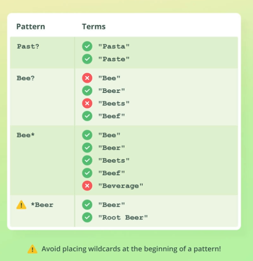

# 🔎 **Prefixes, Wildcards & Regular Expressions**

⚠️ **Prefix Wildcards & Regular Expressions Query sirf keyword fields pe perfect kaam karta hai**, text fields pe perfect km nahi kar ta!

## 📌 **1. Prefix Query**

👉 **Prefix Query** kisi field ke shuruat ke kuch letters ya characters match karta hai.

### 🛠 **Example**

Agar aapko **"Sam"** se start hone wale sabhi names chahiye, toh aap **prefix query** use kar sakte ho:

```json
GET my_index/_search
{
  "query": {
    "prefix": {
      "name.keyword": "Sam"
    }
  }
}
```

📌 **Yeh query sirf unhi documents ko match karegi jisme `name.keyword` field `"Sam"` se start hoti hai**, jaise:
✅ `Samir`  
✅ `Samson`  
❌ `Anshuman` ❌ `Ramesh`

---

## 🔥 **2. Wildcard Query**

👉 **Wildcard Query** ka use tab hota hai jab hume kisi unknown pattern ko match karna ho.

- ✅ **`s*m` (asterisk)** = Multiple characters ke jagah

  - 1️⃣ **First character "s" hona zaroori hai**
  - 2️⃣ **"m" last me hone chahi aa**

- ✅ **`s?m` (question mark)** = Ek single character ke jagah

  - 1️⃣ **First character "s" hona zaroori hai**
  - 2️⃣ **"m" last me hone chahi aa**
  - 3️⃣ only three character ka word hona chahi aa.

## 

## 🔍 **3. Regular Expression Query**

👉 **Regular Expression Query** ka use advanced pattern matching ke liye hota hai.

---

---

# 🎯 **Comparison Table**

| Query Type   | Use Case               | Symbols                   | Example                                    | Performance  |
| ------------ | ---------------------- | ------------------------- | ------------------------------------------ | ------------ |
| **Prefix**   | Starting letters match | `Starts with`             | `"prefix": { "name.keyword": "Sam" }`      | ✅ Fast      |
| **Wildcard** | Partial word match     | `*` (multi), `?` (single) | `"wildcard": { "name.keyword": "S*m" }`    | ⚠️ Slow      |
| **Regex**    | Advanced pattern match | `[a-z]`, `.*`             | `"regexp": { "name.keyword": "S[a-z]*m" }` | 🚨 Very Slow |

---
