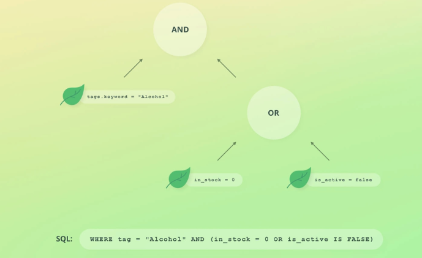

---

Compound Query **mainly 4 types** ki hoti hai:  
1️⃣ **Bool Query**  
2️⃣ **Dis Max Query**  
3️⃣ **Boosting Query**  
4️⃣ **Function Score Query**

👉 **Inke andar bhi chhoti-chhoti queries (Leaf Queries) hoti hain**, jaise:

- **Match Query**
- **Term Query**
- **Range Query**
- **Exists Query**
- **Wildcard Query**

⚡ **Summary:**  
🔹 **Compound Query** → **Multiple Queries ko combine karti hai**  
🔹 **Leaf Query** → **Individual query jo document ko match karti hai**
