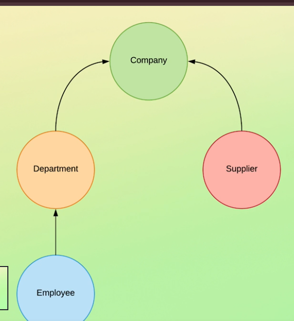
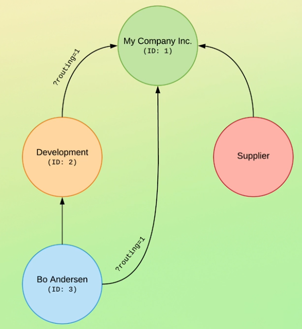
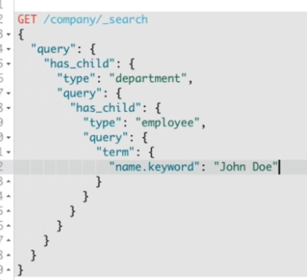

# Multi-Level Parent-Child Relationship in Elasticsearch

This documentation provides a step-by-step guide to setting up a **multi-level parent-child relationship** in Elasticsearch.

---

> **`flow`**
> 

---

> **`how to stored`**
> 

---

> **`how to write nested query`**
> 

---

## **📌 Step 1: Create Index with Parent-Child Mapping**

```json
PUT company_index
{
  "mappings": {
    "properties": {
      "relation_field": {
        "type": "join",
        "relations": {
          "company": ["department", "supplier"],
          "department": "employee"
        }
      },
      "name": { "type": "text" }
    }
  }
}
```

### **📝 Explanation**

- **Company** → Can have **Departments & Suppliers** as children.
- **Department** → Can have **Employees** as children.
- **Supplier** → No further children.

---

## **📌 Step 2: Insert Documents**

### **1️⃣ Add Company (Parent Document)**

```json
POST company_index/_doc/1
{
  "name": "TechCorp",
  "relation_field": "company"
}
```

### **2️⃣ Add Department (Child of Company)**

```json
POST company_index/_doc/2?routing=1
{
  "name": "HR Department",
  "relation_field": {
    "name": "department",
    "parent": 1
  }
}
```

### **3️⃣ Add Supplier (Child of Company)**

```json
POST company_index/_doc/3?routing=1
{
  "name": "ABC Supplies",
  "relation_field": {
    "name": "supplier",
    "parent": 1
  }
}
```

### **4️⃣ Add Employee (Child of Department)**

```json
POST company_index/_doc/4?routing=2
{
  "name": "Alice Johnson",
  "relation_field": {
    "name": "employee",
    "parent": 2
  }
}
```

---

## **📌 Step 3: Search Queries**

### **🔍 Get All Documents**

```json
GET company_index/_search
{
  "query": {
    "match_all": {}
  }
}
```

### **🔍 Get All Employees in a Specific Department**

```json
GET company_index/_search
{
  "query": {
    "has_parent": {
      "parent_type": "department",
      "query": {
        "match": {
          "name": "HR Department"
        }
      }
    }
  }
}
```

### **🔍 Get All Departments & Suppliers Under a Company**

```json
GET company_index/_search
{
  "query": {
    "has_parent": {
      "parent_type": "company",
      "query": {
        "match": {
          "name": "TechCorp"
        }
      }
    }
  }
}
```

---

## **🚀 Summary**

✅ **Multi-level parent-child relations set up correctly:**

- **Company** → (Parent of) → **Departments, Suppliers**
- **Department** → (Parent of) → **Employees**
- **Supplier** → (No further children)

🚀 **Now you can efficiently query hierarchical data using Elasticsearch!**
